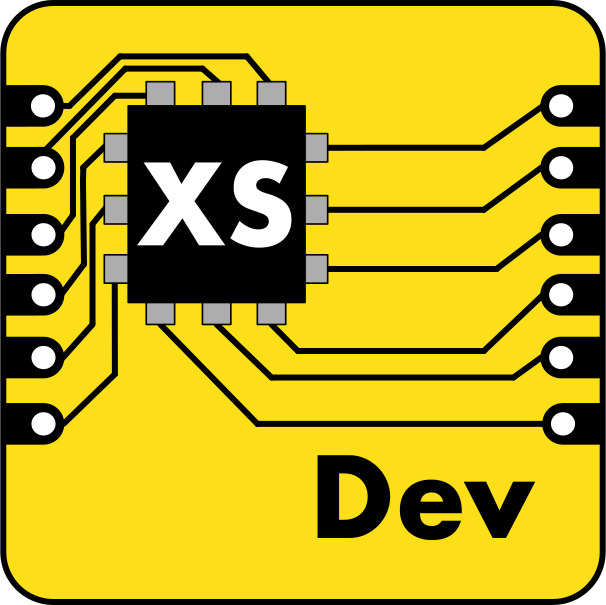

# CLI for automating the setup and usage of [Moddable XS tools](https://github.com/Moddable-OpenSource/moddable/blob/public/documentation/Moddable%20SDK%20-%20Getting%20Started.md)

The Moddable SDK and associated dev board tooling is incredibly empowering for embedded JS hardware development, however the set up process can be tedious to follow when getting started. This project aims to streamline the install and environment configuration requirements across platforms in just a few commands.

[Check out the documentation!](https://hipsterbrown.github.io/xs-dev/)

**This project is a work in progress and currently pre-1.0, so there may be breaking changes.**

## Requirements

[Node.js](https://nodejs.org/en/), at least the [active LTS version](https://nodejs.org/en/about/previous-releases#nodejs-releases).

_If you've never installed Node.js before, check out the [getting started guide for xs-dev](https://hipsterbrown.github.io/xs-dev/guide/00-prepare#nodejs-package-manager-optional)._

[XZ utils](https://tukaani.org/xz/) are required to install the CLI due to a dependency for decompressing the ARM toolchain used for nrf52 development.

It can be installed with Homebrew on MacOS:

```
brew install xz
```

Or as `xz-utils` on Linux distributions like [Ubunutu](https://packages.ubuntu.com/search?keywords=xz-utils):

```
apt-get install xz-utils
```

**On Linux:**

Setup commands rely on [`ssh-askpass`](https://packages.ubuntu.com/focal/ssh-askpass) to prompt for permission when installing other tools and dependencies.


## Install

```
npm install -g xs-dev
```

```
pnpm install -g xs-dev
```

```
yarn global add xs-dev
```

## Update to latest release

```
npm update -g xs-dev
```

```
pnpm update -g xs-dev
```

```
yarn global upgrade xs-dev
```

## Features & Usage

Check out the [docs](https://hipsterbrown.github.io/xs-dev/) to learn about using xs-dev and getting started with embedded JS development.

## Development

Clone the project and install dependencies. We're using [pnpm](https://pnpm.io/) and [volta](https://volta.sh/) to manage packages and Node.

```
git clone https://github.com/HipsterBrown/xs-dev.git
cd xs-dev
pnpm install
```

Link dev version of CLI using `pnpm`, which will override any other globally installed version:

```
pnpm link --global
pnpm link --global xs-dev
```

Or create an alias to clearly denote the local version of the CLI:

```
alias local-xs-dev=$PWD/bin/xs-dev
```

To maintain the alias between shell sessions, for example I use zsh:

```
echo "alias local-xs-dev=$PWD/bin/xs-dev" >> ~/.zshrc
```

## Docs

The documentation site is built with [Astro](https://astro.build) with the [Starlight template](https://starlight.astro.build/) and can be found in the `docs/` directory. When working on them locally, run `pnpm start:docs` to start the development server that watches for file changes and reloads the page.

### 🚀 Docs Project Structure

Inside of your Astro + Starlight project, you'll see the following folders and files:

```
.
├── public/
├── src/
│   ├── assets/
│   ├── content/
│   │   ├── docs/
│   │   └── config.ts
│   └── env.d.ts
├── astro.config.mjs
├── package.json
└── tsconfig.json
```

Starlight looks for `.md` or `.mdx` files in the `src/content/docs/` directory. Each file is exposed as a route based on its file name.

Images can be added to `src/assets/` and embedded in Markdown with a relative link.

Static assets, like favicons, can be placed in the `public/` directory.

## Contributors ✨

Thanks goes to these wonderful people ([emoji key](https://allcontributors.org/docs/en/emoji-key)):

<!-- ALL-CONTRIBUTORS-LIST:START - Do not remove or modify this section -->
<!-- prettier-ignore-start -->
<!-- markdownlint-disable -->
<table>
  <tr>
    <td align="center"><a href="https://hipsterbrown.com/"><br /><sub><b>Nick Hehr</b></sub></a><br /><a href="https://github.com/HipsterBrown/xs-dev/commits?author=HipsterBrown" title="Documentation">📖</a> <a href="#infra-HipsterBrown" title="Infrastructure (Hosting, Build-Tools, etc)">🚇</a> <a href="https://github.com/HipsterBrown/xs-dev/commits?author=HipsterBrown" title="Code">💻</a></td>
    <td align="center"><a href="https://moddable.com/"><br /><sub><b>Andy Carle</b></sub></a><br /><a href="https://github.com/HipsterBrown/xs-dev/commits?author=andycarle" title="Code">💻</a></td>
    <td align="center"><a href="https://moddable.com/"><br /><sub><b>Peter Hoddie</b></sub></a><br /><a href="https://github.com/HipsterBrown/xs-dev/commits?author=phoddie" title="Code">💻</a></td>
    <td align="center"><a href="https://github.com/stc1988"><br /><sub><b>Satoshi Tanaka</b></sub></a><br /><a href="https://github.com/HipsterBrown/xs-dev/commits?author=stc1988" title="Code">💻</a></td>
    <td align="center"><a href="https://linktr.ee/scr34mz"><br /><sub><b>Andréas Hanss</b></sub></a><br /><a href="https://github.com/HipsterBrown/xs-dev/commits?author=ScreamZ" title="Documentation">📖</a></td>
    <td align="center"><a href="https://github.com/intGus"><br /><sub><b>Gustavo</b></sub></a><br /><a href="https://github.com/HipsterBrown/xs-dev/commits?author=intGus" title="Code">💻</a></td>
    <td align="center"><a href="https://github.com/gibson042"><br /><sub><b>Richard Gibson</b></sub></a><br /><a href="https://github.com/HipsterBrown/xs-dev/commits?author=gibson042" title="Documentation">📖</a></td>
  </tr>
  <tr>
    <td align="center"><a href="https://dev-portfolio-jay.netlify.app/"><br /><sub><b>Jay Kesarkar</b></sub></a><br /><a href="https://github.com/HipsterBrown/xs-dev/commits?author=jaykesarkar" title="Code">💻</a></td>
    <td align="center"><a href="https://gustavo.is"><br /><sub><b>Gustavo Gallegos</b></sub></a><br /><a href="https://github.com/HipsterBrown/xs-dev/commits?author=pricklywiggles" title="Documentation">📖</a></td>
    <td align="center"><a href="http://dtex.github.com"><br /><sub><b>Donovan Buck</b></sub></a><br /><a href="https://github.com/HipsterBrown/xs-dev/commits?author=dtex" title="Code">💻</a></td>
    <td align="center"><a href="https://github.com/mkellner"><br /><sub><b>Michael Kellner</b></sub></a><br /><a href="https://github.com/HipsterBrown/xs-dev/commits?author=mkellner" title="Code">💻</a></td>
    <td align="center"><a href="http://brainofdane.com/"><br /><sub><b>Dane Henson</b></sub></a><br /><a href="https://github.com/HipsterBrown/xs-dev/commits?author=dahenson" title="Code">💻</a></td>
    <td align="center"><a href="https://github.com/kitazaki"><br /><sub><b>Ayachika Kitazaki</b></sub></a><br /><a href="https://github.com/HipsterBrown/xs-dev/commits?author=kitazaki" title="Code">💻</a></td>
    <td align="center"><a href="https://andrew.nonetoohappy.buzz/"><br /><sub><b>Andrew Chou</b></sub></a><br /><a href="https://github.com/HipsterBrown/xs-dev/commits?author=achou11" title="Code">💻</a></td>
  </tr>
</table>

<!-- markdownlint-restore -->
<!-- prettier-ignore-end -->

<!-- ALL-CONTRIBUTORS-LIST:END -->

This project follows the [all-contributors](https://github.com/all-contributors/all-contributors) specification. Contributions of any kind welcome!
