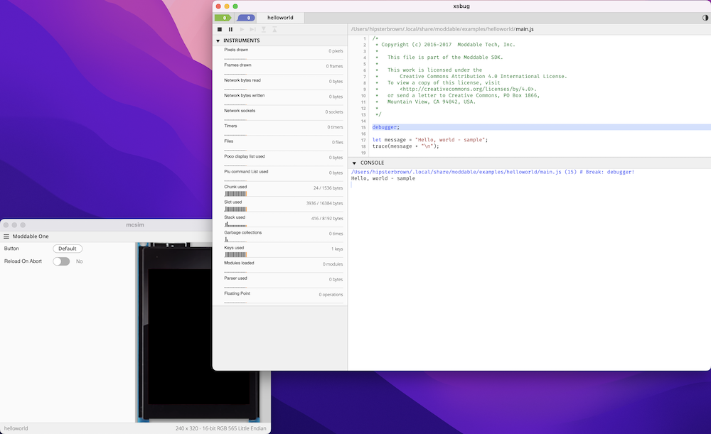

**How to set up the basic development environment and run your first program**

## Install the CLI

`xs-dev` can be installed globally using the [NodeJS package manager of your choice](/guide/00-prepare#nodejs--package-manager-optional).

```
npm install -g xs-dev
```

```
pnpm install -g xs-dev
```

```
yarn global add xs-dev
```

## Setup system tooling

As specified in the [setup documentation](/features/setup/), the [Moddable SDK and associated tooling](https://github.com/Moddable-OpenSource/moddable/blob/public/documentation/tools/tools.md) is installed using the following command:

```
xs-dev setup
```

This will determine the correct tooling to install based on your operating system.

**[Windows support is currently in beta](https://github.com/HipsterBrown/xs-dev/pull/63)**

Once this process is done, you should see a success message:

```
Moddable SDK successfully set up! Start a new terminal session and run the "helloworld example": xs-dev run --example helloworld
```

or on Windows, you should see the following:

```
Moddable SDK successfully set up!
A shortcut to the Moddable Command Prompt has been created at \xs-dev\Moddable Command Prompt.lnk.
You should always use the Moddable Command Prompt when working with the Moddable SDK.
The Moddable Command Prompt will now open for you in a new Window. Please close this Command Prompt and use the Moddable Command Prompt instead.
As a next step, try running the "helloworld example" in the Moddable Command Prompt: xs-dev run --example helloworld'
```

## Run the Hello World example

To start a new terminal session, you can either execute your shell of choice (`bash`/`zsh`/`fish`), create a new terminal window / tab, or start the Moddable Command Prompt on Windows. This will ensure the expected tooling is available in your session [PATH](https://en.wikipedia.org/wiki/PATH_(variable)).

You can [run any Moddable example included in the SDK](/features/run#moddable-examples). The "Hello World" example provides the simplest program to get started and can be run in the [simulator](https://github.com/Moddable-OpenSource/moddable/blob/public/documentation/tools/tools.md#simulator):

```
xs-dev run --example helloworld
```

This will start up the debugger and simulator:



This will keep running until interrupted using the `Ctrl+C` keys in the terminal session or both apps are quit.

## Keep exploring!

Use the `--list-examples` flag with the `run` command to search the extensive list of available examples to run in the simulator: `xs-dev run --list-examples`

When you're ready to move on, it's time to [create your first project and control some hardware](/guide/02-blinky).

## Troubleshooting

When attempting to run the Hello World example, if you continually see the following error (even after starting a new terminal session):

```
Moddable tooling required. Run 'xs-dev setup --device <computer os here>' before trying again.
```

There may be an issue with the terminal shell or command prompt using the correct [environment configuration](/features/setup#overview) for xs-dev.

- [Learn about Terminal profiles on MacOS](https://support.apple.com/guide/terminal/default-startup-terminal-window-profiles-trml5856b1f2/mac)
- [Learn about shell initialization files and user profiles on Linux](https://www.tecmint.com/understanding-shell-initialization-files-and-user-profiles-linux/)
- [Learn about Windows Terminal startup settings](https://learn.microsoft.com/en-us/windows/terminal/customize-settings/startup)

On "Unix-like" environments (MacOS, Linux), the `env` command should contain a reference to the `MODDABLE` environment variable:

```
env | grep MODDABLE
```
The above command should return something like `MODDABLE=/Users/<username>/.local/share/moddable` to indicate where the Moddable SDK has been installed in the filesystem.

Running [`xs-dev doctor` command](/features/doctor) will display relevant info about the development environment, which can be helpful for debugging and sharing in support issues:

```
xs-dev environment info:
  CLI Version                0.36.5
  OS                         Darwin
  Arch                       arm64
  NodeJS Version             v22.10.0 (/path/to/node)
  Python Version             3.12.8 (/path/to/python)
  Moddable SDK Version       5.3.3 (/path/to/moddable)
  Supported target devices   mac

If this is related to an error when using the CLI, please create an issue at "https://github.com/hipsterbrown/xs-dev/issues/new" with the above info.
```
